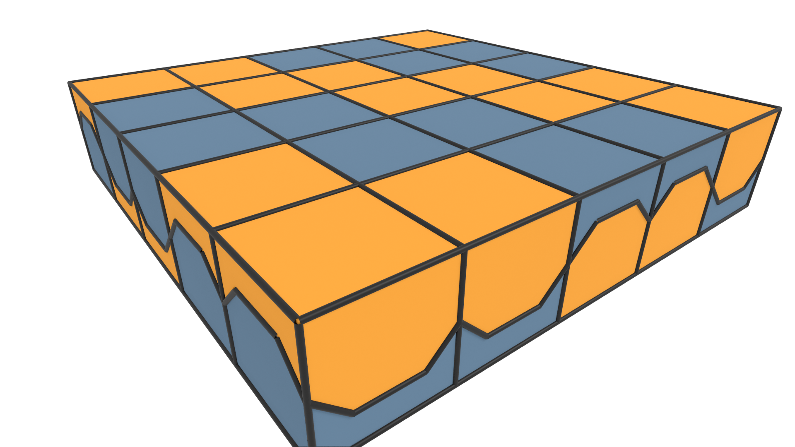
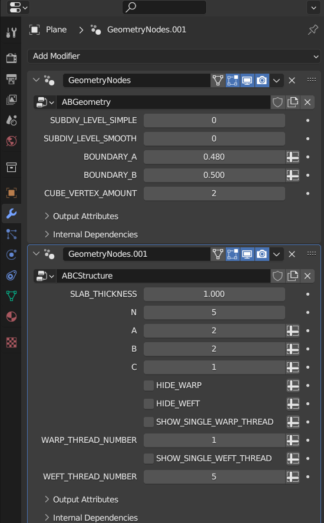
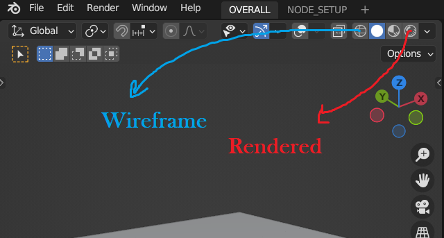

# A Modular Approach for Creation of Any Bi-Axial Woven Structure with Congruent Tiles

Within this repository Blender programs and Geometry Nodes feature is used to develop the congruent tiles. 

```models``` directory contains 3D printable .stl files of the shapes with slots.

```shape_generator.blend``` is used for generating the congruent tiles

```shape_generator_demo.blend``` contains a animation demo of the heightfields tiles 

```shape_foldings.blend``` contains animations for folding and unfolding of the congruent tiles

```voronoi_partition_finding_2D.blend``` is used for finding voronoi partitions from the curved voronoi sites using a finite voxel data structure

## Installation

To use these blender files you need to have a stable release of blender 3.5+, which can be found [here](https://www.blender.org/download/releases/3-5/).

## Shape Generation Controls
Shape generator can be controlled through the Geometry Nodes modifier inputs that can be accessed through the Blender interface:



### ABGeometry Controls
```SUBDIV_LEVEL_SIMPLE```: 
    Controls the simple subdivision used for subdividing the bounday curve
    
```SUBDIV_LEVEL_SMOOTH```: 
    Controls the catmull-clark subdivision used for subdividing the boundary curve
    
```BOUNDARY_A```:
    Controls the A parameter(i.e. height difference) of the boundary curve
    
```BOUNDARY_B```:
    Controls the B parameter(i.e. width difference) of the boundary curve
    
```CUBE_VERTEX_AMOUNT```:
    Controls the amound of verticec in the fundamental cube region, this might be needed for finer displacement of the shape later on if needed.


### ABCStructure Controls
```SLAB_THICKNESS```:
    Controls the height of the fundamental tile
    
```N```:
    Number of warp and weft threads, single value creates a square fabric pattern
    
```A```:
    Number of warps before wefts
    
```B```: 
    Number of wefts after warps
    
```C```:
    Shift amount at each different row
    
```HIDE_WARP```:
    Hides warp threads
    
```HIDE_WEFT```:
    Hides weft threads
    
```SHOW_SINGLE_WARP_THREAD```:
    Shows only a single warp thread defined by the WARP_THREAD_NUMBER=\[0,N-1\]
    
```WARP_THREAD_NUMBER```:
    Warp thread to be shown if SHOW_SINGLE_WARP_THREAD is selected

```SHOW_SINGLE_WEFT_THREAD```:
    Shows only a single weft thread defined by the WEFT_THREAD_NUMBER=\[0,N-1\]
    
```WEFT_THREAD_NUMBER```:
    Weft thread to be shown if SHOW_SINGLE_WEFT_THREAD is selected

	
## Rendering

To get different rendering of the shape you can use Blender's features which can be accessed through the viewport interface:


